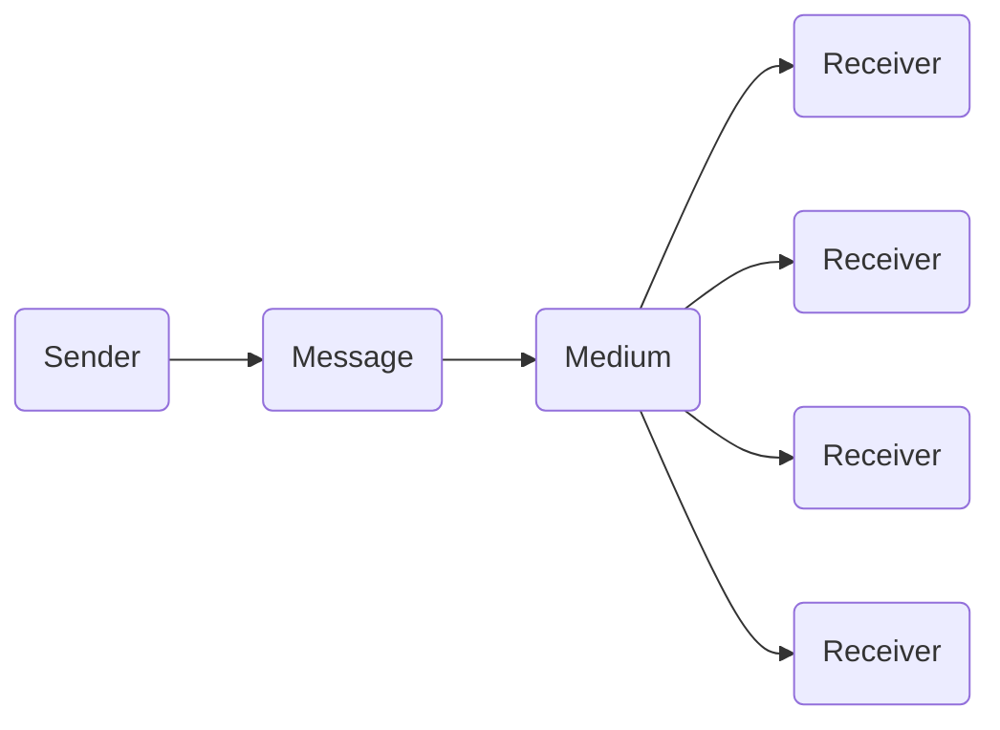

---
tags:
  - com_101
---

## Interpersonal communication

- One-to-one
- More interactive
- Involves single-known receiver

## Mass communication

- One-to-many
- Allows limited interaction
- Involves a potentially large and unknown audience

## The internet

- Blurs lines between interpersonal and mass communication
- Allows users to be more active

### Communication today

- Industry replaces *sender*
- Content replaces *messages*
- Technology replaces *medium*
- Users replaces *receivers*