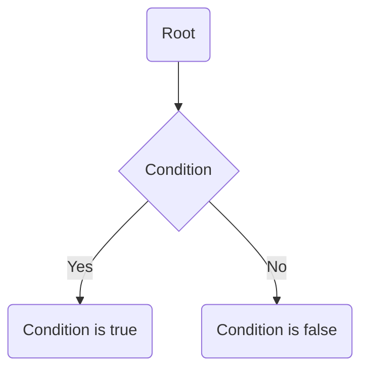

---
tags:
  - cpt_s_121
  - control_structures
---

-> [Lecture code](https://github.com/mathletedev/cpt_s/blob/main/121/lectures/2023-09-20)

## DeMorgan's Law

`x && y` -> `!x || !y`
`x || y` -> `!x && !y`

## Representation

Use a diamond with 2 paths (true/false) to represent a condition

