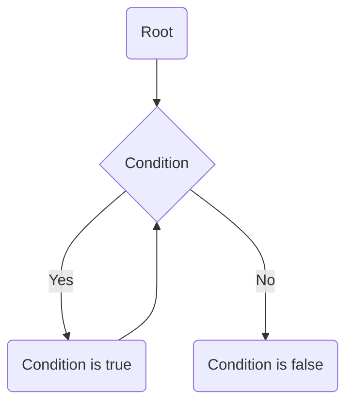

#cpt_s_121 

-> [Lecture code](https://github.com/mathletedev/cpt_s/blob/main/121/lectures/2023-09-22)

- Used to reduce redundancy

## Representation

Use a diamond with one path pointing back to represent a loop



### Example

```c
int count = 0;

while (count < 10)
```

## Types

### While loop
```c
int count = 1;

while (count <= 10) {
	printf("count: %d\n", count);
	++count;
}
```

### For loop

```c
for (int i = 1; i <= 10; ++i) {
	printf("count: %d\n", count);
}
```

### Do-while loop

```c
int count = 1;

do {
	printf("count: %d\n", count);
	++count;
} while (count <= 10);
```