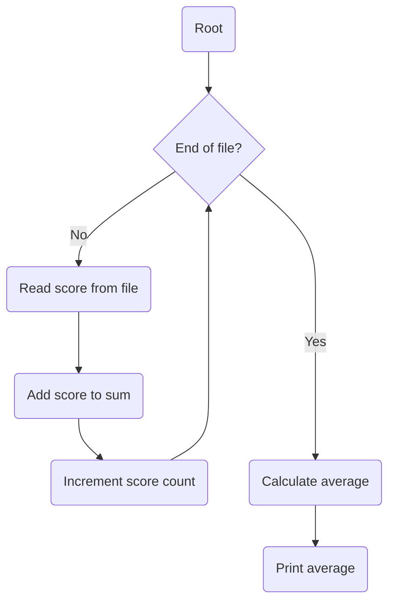

---
tags:
  - cpt_s_121
  - control_structures
---

-> [Lecture code](https://github.com/mathletedev/cpt_s/blob/main/121/lectures/2023-09-25)

## When are loops needed?

- No -> No loop required
- Yes -> Do you know in advance how many steps are repeated?
	- No -> Use a conditional loop
	- Yes -> Use a counting loop

## Flowchart - Calculate average score



## End of file

`int feof(FILE *__stream)`: Returns `1` if `EOF` is reached, or `0` otherwise

Useful in combination with a while loop:
```c
FILE *input_stream = fopen("input.txt", "r");

if (input_stream != NULL) {
	while (!feof(input_stream)) {
		// fscanf() to read data from file
	}
}
```

## Incrementing variables

```c
++count; // pre-increment operator
count++; // post-increment operator
```