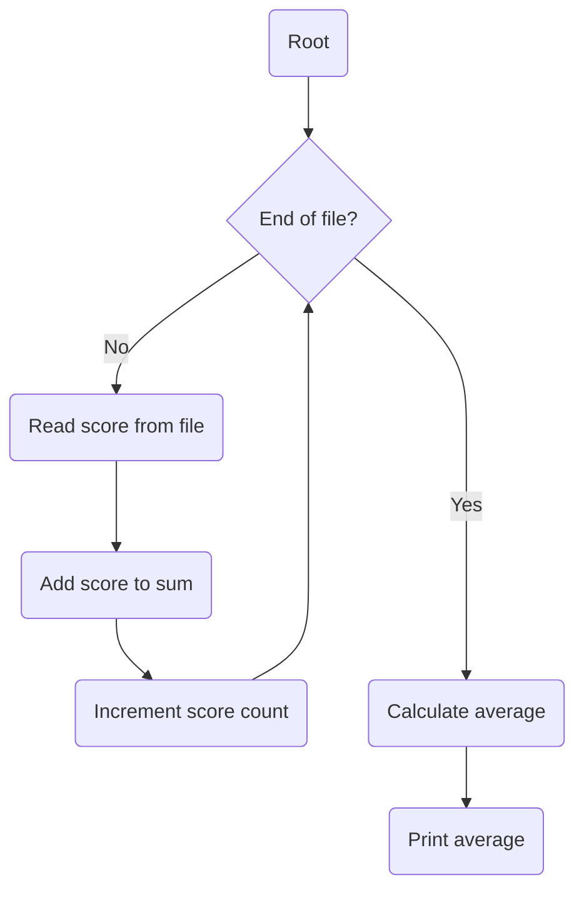

#cpt_s_121 

## When are loops needed?

- No -> No loop required
- Yes -> Do you know in advance how many steps are repeated?
	- No -> Use a conditional loop
	- Yes -> Use a counting loop



## Incrementing variables

```c
++count; // pre-increment operator
count++; // post-increment operator
```