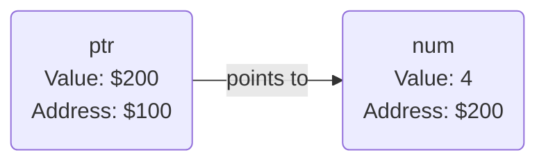

---
tags:
  - cpt_s_121
---

Function parameters are copied, so any modification to a variable inside of a function will not affect the variable outside of the function.

```c
int main() {
	int num = 4;
	num = f(num);
}

int f(int n) {
	++n; // does nothing
}
```

## Pointers

> A *pointer* is a variable that stores the *address* of another variable



`&`: address operator / reference declarator
`*`: indirect value operator / pointer declarator

**dangling pointer**: A pointer that points to a deallocated variable