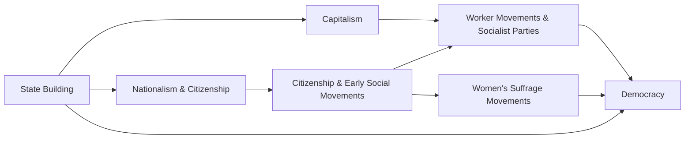

---
tags:
  - pol_s_102
created: 2024-10-29
updated: 2024-10-31
---

## Capitalist Development and Democracy

As we've seen, a crucial causal link in our causal model is from *working-class collective action* to democracy.

- The literature on this topic makes two types of claims, typical of a political economic theory:
  - Capitalist development changes the *distribution of power in society* so that pro-democratic groups gain power and anti-democratic groups lose power.
  - Capitalist development changes the class structure: Under industrial capitalism, there is a new class with *pro-democratic political preferences*.
  
## Capitalist Development Shifted the Balance of Class Power

- Decreased the power of large landlords who benefit from extractive institutions.
- Increased the power of working classes who are consistent advocates for inclusive economic and political institutions.
  - Better working conditions
  - Universal franchise and parliamentary government
- Urban middle classes straddle the divide: In general, prefer more inclusive economic and political institutions (rise of liberal movements advocating for private property, parliamentary supremacy, and secularism), but fearful of potentially radical workers.

Increased industrialisation -> increased chance of democratic transition

## New Class with Pro-Democratic Political Preferences

Social movements are critical, but not the entire story.

Can't ignore the independent role of the bureaucratic state and the rule of law:
- Autocratic rulers can no longer treat the state as their personal property: Reduces their capacity to repress society
- Emergence of middle-class public servants: Belief in rule of law generates demand for constitutional rule

Emergence of middle professional class - doctors, lawyers, engineers, managers, teachers - as constituency for non-autocratic rule.

Professional politicians: View non-elite classes in society as potentially valuable political allies, push for suffrage expansion and political mobilisation.

## Towards a Broader Theory of Democratic Transitions

- Relative to Europe, the post-colonial world is much less wealthy. The post-colonial world did not experience a comparable commercial revolution - which means they didn't develop the same labour-based social movements.
- If this is correct, we should see a particular pattern when we look at data on democratic transitions and democratic breakdowns:
  1. Wealth and democracy are positively related
  2. The effect of economic growth (higher levels of wealth over time) on the probability of democracy should differ between countries with extractive economic institutions: Therefore, we should see a strong relationship of income to democratic transition in earlier periods (1870-1920) but not in later periods (when post-colonial nations numerically dominate the data).

## Early Democratic Transitions

Features:
- Competitive elections between two or more parties to fill executive and legislative offices
- Elections cause observable alternation in power

Early democracies have suffrage restrictions considered unacceptable today, especially restriction of franchise to white men.

## Income and Democracy

- Given: A country is either **autocratic** or **democratic**, and also...
- Assumption: In every year, a country has a non-zero probability of a regime transition
- Observation: Wealthy countries tend to be democratic, and poor countries tend to be autocratic (authoritarian, dictatorships, etc.)

There are two possible (and non-exclusive) interpretations of this relationship.

Interpretation #1: As a country becomes wealthier, it is more likely to become a democracy.

Rising levels of wealth *directly increase the probability of a democratic transition* from an autocratic regime in one year to a democratic regime in the next year.

Interpretation #2: As a country becomes wealthier, it is not more likely to become a democracy; the probability of a democratic transition remains constant as wealth increases.

The probability in a given year of a democratic transition is *statistically independent* of the level of wealth.

However, if a country becomes democratic for reasons other than its growing level of wealth, then rising levels of wealth make it more likely that the country will remain democratic. Rising levels of wealth *cause a decrease in the probability of an autocratic transition or democratic breakdown*.

## Transition Matrix

|             | $A_t$    | $D_t$    |
| ----------- | -------- | -------- |
| $A_{t - 1}$ | $P_{AA}$ | $P_{AD}$ |
| $D_{t - 1}$ | $P_{DA}$ | $P_{DD}$ |

- $A$ = Autocratic or Authoritarian
- $D$ = Democratic
- $t - 1$: The regime last year
- $t$: The regime this year

### Two Hypotheses

- $h_1$: Rising income causes $P_{AD}$ to increase (equivalently: Rising income causes $P_{AA}$ to decrease). Call this the **endogenous** version of modernisation theory.
- $h_2$: Rising income causes $P_{DA}$ to decrease (equivalently: Rising income causes $P_{DD}$ to increase). Call this the **exogenous** version of modernisation theory.

---

## Boix and Stokes: Three Criticisms of P&L

### Dwindling Numbers = Higher Uncertainty

- Our confidence in a statistical procedure is positively related to the square root of the sample size: All else equal, more information = less uncertainty = more confidence.
- At lower levels of income, there are many autocratic country-years because there are many poor countries, most of which have not yet democratised: Our confidence in our estimate of $P_{AD}$ should be correspondingly high.
- At higher levels of income, there are very few autocratic country-years because most wealthy countries are already democratic and so our confidence in the estimate of $P_{AD}$ should be correspondingly low: Just a single measurement error or chance event has enormous consequences for the estimated probability.

## Sampling Bias

- Sampling bias refers to inferences drawn from samples that are not representative of the larger population about which we wish to draw inferences - survivorship bias, for example.
- Observations that begin in 1950 *do not observe early (1870-1920) democratic transitions in European countries* and so underestimate the relationship of rising income to the probability of democratic transition.
- The earl democratisers may provide evidence consistent with the hypothesis, but we do not observe that evidence because their transitions occur prior to the starting date of the dataset.

## Omitted Variable Bias

Some countries will not exhibit the predicted relationship:
- Oil may "artificially" prolong the duration of a dictatorship
- Soviet bloc countries prevented from democratic transitions by force of arms

## Main Result

When we extend the coverage of the data to include observations starting in 1850:
- It appears that there is temporal heterogeneity in the relationship of income and the probability of democratic transition.
- There is a relatively constant relationship between income and the probability of a democratic breakdown across all time periods.

## Putting It All Together: Early Transitions to Democracy

> *Important*
> Know **inclusive** and **exclusive** economic institutions.

19th and early 20th-century Europe had three essential features conducive to democratic transitions:
1. Economic structures that favour collective action.
  - Collective action should be easier with shift to factory production
2. States under threat of constant warfare and that increasing depend on the acquiescence of citizens to pay taxes, serve in armed forces, and more generally comply with state regulations.
3. Inclusive economic institutions that soften elite incentives to be anti-democratic.
  - Transition from agrarian economies to industrial economies
  
## Transitions to Democracy: Brief Examples

- Early democratisers (Switzerland, England, France): Mid 19th-century transitions led by middle-class reformers. Labour is not yet highly organised and radicalised. Reformers see workers as valuable electoral allies and extend the franchise.
- Later democratisers (Germany): Early 20th century, workers are far more radical and much better organised, genuine threat of socialist revolution. transition follows conclusion of WWI. Democracy takes place amid political crisis, much more difficult transition, in which working-class organisations play a more prominent role.
- Countries that democratised prior to WWI remained democratic during the interwar period; countries that democratised after WWI suffered democratic breakdown in the interwar period.

## Why Democratic Transitions Would Be More Difficult in the Post-Colonial World

The post-colonial world, in contrast:
- Persistence of extractive economic institutions that generate intransigently anti-democratic elite incentives.
- Economic structures that do not favour collective action (agriculture = dispersed work-forces; exploitation of natural resources).
- States that are not under threat of constant warfare and that receive substantial political, economic, diplomatic, military support from the Great Powers.
  - Persistence of patrimonial state structures, low infrastructural power, high levels of corruption

## The Bottom Line

Relative to Europe, the post-colonial world may need a higher level of collective action to overcome elite intransigence - but has worse prospects for achieving it, ergo increasing the difficulty of securing a regime change.