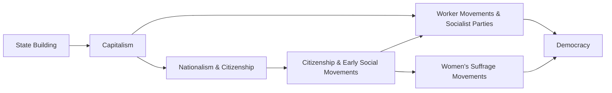

---
tags:
  - pol_s_102
created: 2024-10-22
---

## From Nationalism and Citizenship Towards Democratic Transitions

Beyond nationalism and citizenship, projects of legibility and the increasing weight of the state on society had unintended consequences: They gave rise to social movements.

## Contentious Politics

To this point, we have spoken exclusively about elites and the ruling class.

Ordinary people engage in contentious politics:
- Ordinary people confront elites and authorities
- Power based on numbers - collective action
- Pre-modern contentious politics were almost always local, ephemeral, and non-institutionalised

Over time, projects of legibility and the emergence of nationalism and citizenship would give rise to new forms of contentious politics: Social movements.

Groups of local people would discuss their grievances and address problems; these groups wouldn't last long. No huge uprisings.

## What Do All These Movements Have in Common?

- Broad-based collective action by ordinary citizens
- Aimed at national-level politics
  - Unlike pre-modern times, when everything was local
- Efforts to hold state accountable

## Modern Social Movements

In contrast to pre-modern forms of contentious politics - local, ephemeral, and non-institutionalised - modern social movements are:

- Broad-based collective challenges, built on common purposes and social solidarities, in sustained interaction with authorities, elites, and opponents, often working through complex organisations.

## Two Big Questions

Origins of social movements: How do social movements overcome the collective action problem?
- Political reforms due to pressure from below are public goods: How to ordinary people overcome the free-rider problem?
- Consequences of social movements: Specifically, what role do they play in democratic transitions?

## State Building, Social Movements, and Citizenship

- By the late 18th century, tax revolts were becoming sufficiently broad-based and well-organised to generate national movements challenging elites and authorities.
- Nationalism + tax revolts led to a continent-wide assault on aristocratic privilege.
- In the late 18th century, a new relationship emerges between ruler and ruled: Citizen and citizenship.
- Citizen: New category of identity and persons defined exclusively by their legal attachment to the state, not by their status at birth.
- Citizenship: Set of enforceable rights and obligations *shared uniformly among members of the nations*, creates ideas about political equality.

## Democracy and Social Movements

John Markoff, Where and When Was Democracy Invented? Page 689:

*Driving force for democratisation often originated among those who challenged the elites.* - Bottom-up pressure leads to today's democracy

## The Long Century of Democracy

Democracy did not emerge fully-formed at one time from the new ideas and practices of nationalism, citizenship, and social movements.

## Outcomes

Late 18th, early to mid-19th century: Emergence of liberal and republican movements, mostly spearheaded by new middle class (lawyers, doctors, engineers, writers, journalists).

Seek limited forms of representation and constitutional government - government authority rooted in popular sovereignty, not dynastic legitimacy.

Early reformers often seek limited reforms and fear mass political participation.

1870-1920: Democratic transitions across Europe.

Two major dimensions, both of which are necessary to consider a political regime democratic:
- Establishment of parliamentary sovereignty
- Transition to universal male suffrage
  - Universal female suffrage will lag behind male suffrage by several decades

## Catalyst of Democratising Reforms (and Sometimes Reaction): Working-Class Politics

- 19th-century industrial revolution produces a new class: Industrial labour, working under brutal conditions, averaging 61% of total workforce by 1910.
- New economic structure of factory production favoured collective action.
- Workers form associations of mutual assistance, out of which labour unions emerge, incorporating about one-tenth of labour by 1914.
- Parallel to worker collective action, emergence of political parties representing workers, averaging one-fourth of all votes by 1914.

Terrible working conditions, workers complain after work. Radicals take over Europe and call for economic revolution.

## Three Theories of Capitalism, Social Movements, and Communism

- Karl Marx
- V.I. Lenin
- Antonio Gramsci

"A spectre is haunting Europe; a spectre of communism"

> *Karl Marx*
> "Let the ruling classes tremble at a Communistic revolution. The proletarians have nothing to lose but their chains. They have a world to win. Workingmen of all countries unite!"

> *Lenin*
> "The spontaneous development of the working-class movement leads to its subordination to bourgeois. Hence, our task, the task of Social Democracy, is to divert the working-class movement from this spontaneous, trade-unionist striving and to bring it under the wing of revolutionary Social Democracy."

> *Gramsci*
> "The traditional ruling class, which has numerous trained cadres, changes men and programmes and, with greater speed than is achieved by the subordinate classes, reabsorbs the control that was slipping from its grasp. Perhaps it may make sacrifices, and expose itself to an uncertain future by demagogic promises; but it retains power, reinforces it for the time being, and uses it to crush its adversary and disperse his leading cadres, who cannot be very numerous or highly trained."

## Marx and the Absence of Communist Revolutions in Capitalist Countries

- Marx and Engels predicted inevitable communist revolutions, brought about by the inexorable logic of capitalism.
- It is fair to say that this prediction has not come true: Orthodox Marxism has been falsified.
  - Turns out, very difficult for workers to unite: Problem of collective action
  - Believed state would always comply with capitalists
- Marx believed that class contradictions made revolution inevitable; failed to consider the logic of collective action and the role of leaders, organisations, and culture.

*Underestimated the power and autonomy of the state.*
*States were under strain by excessive warfare, eager to maintain peace.*

States bargain with citizens: More say in exchange for private property.

## How Contemporary Social Scientists Think About Collective Action

- Strategic action and game theory: The logic of collective action organisations and resources
- Public goods characterised by: **Jointness of supply** and **non-excludability**
- States, state strategies, and structures of political opportunity

## The Problem of Collective Action

If we think of states as organisations that provide **public goods**, then collective action to form a social movement that challenges the state is also a public good, plagued by the problem of free-riding.

## The Prisoner's Dilemna

**Equilibrium**: An action taken by each player such that no player can improve playoffs given the actions of other players.

## Musings

We need a theory to explain why collective action / social movements are relatively infrequent.

The free-riding / prisoner's dilemma framework predicts that cooperation for collective goods should never happen - it over-estimates the problems of collective action.

The problem of free-riding explains why a player would not cooperate, given anticipation of how others will act.

An alternative framework is based on mutual expectations: Players will cooperate if everyone else does.

## An Assurance Game

Assurance games are based on **mutual expectations**: If I expect you to protest, I will protest too. Protests occur if a sufficient number of players share these mutual expectations.

"You may not have done anything, but I will teach all of you a lesson" - Crucifixion method

## Emotions

Evidence exists that people will join social movements if they think the movement represents **justice**.
- Justice is a public good, but a particular kind: Invokes complex emotions like pride and self-identity as a "moral" person

But this still can't explain everything - plenty of people still stay home.

For some, the best outcome is participating in the quest for justice.

## Risk Aversion

- Some people are highly risk accepting: They will participate if they anticipate that a small number of others will participate.
- Others are highly risk averse: They will participate only if they anticipate large numbers of co-participants.

Note: Hindsight is 20/20; no one anticipates huge changes but they are easy to see in hindsight.

Million-dollar game:
- Button 1 is 100% one million dollars
- Button 2 is 50% two million dollars

## The Problem of Concealed Preferences

- Dictatorships can disrupt the formation of mutual expectations of collective action by fostering mutual mistrust (extensive security apparatus & demand that citizens publicly profess loyalty to regime).
- Players have incentives to conceal their true preferences, or dissimulate, making it difficult to judge the probability that other will act.
- This is a problem of **asymmetric information**.

For action to occur, there must be *mutual knowledge*.

## Information Cascades and Dissent

- **Information cascade**: First the most risk-accepting people participate, and their participation gradually induces the more risk-averse to participate, until even the most risk averse have joined in; crowds start small and may quickly swell to large sizes.
- Each person *updates their expectations as private information becomes public information*.
- This is why outbursts of social movements can be unpredictable, and dictatorships are so keen to suppress any sign of dissent.

A.k.a. "Snowball effect"

## A Toy Model of Risk Thresholds

- Individual $i$ has a threshold, $t_i$, defined as the number of protesters, $P$, that $i$ must observe participating before joining collective protest action: $i$ participates if $P > t_i$.
- A risk profile, $T$, is just a collection of individual risk thresholds. Let's look at different possible risk profiles in a population of five people.
  1. $T = \{ 0, 1, 2, 2, 2 \}$: All participate because the first person is highly risk-accepting
  2. $T = \{ 1, 1, 2, 2, 2 \}$: None praticipate
  3. $T = \{ 0, 1, 2, 3, 4 \}$: All participate
- Note that in the three scenarios, $\overline t = 1.4; 1.6; 2.0$, so mean level itself does not predict participation.

## Contingency and Surprise

- The risk aversion model is surely too simple, and it is simply not possible to gain access to the distribution of risk.
- But if these speculations about preference concealment and information cascades are correct, then we have an appreciation of why revolutions like the Arab Spring take everyone, observers and participants, by surprise.
- It might be the case that we can explain after the fact, but we cannot predict...

## Another Important Concept: Political Opportunity Structure

- The way a country's political system *shapes, promotes, checks, or absorbs the challenges* it confronts from organised civil society
- The relative degree of *openness or closure of a polity* to new forms of contentious politics
- Provides *incentives and disincentives for collective mobilisation*: Affects individuals' and leaders' beliefs about the likelihood of success

## Bringing This All Together...

Tarrow, Social Movements and Contentious Politics

- When do people engage in contentious politics?
  - Argument: When political opportunities increase, political constraints decrease, and create new opportunities via collective action, which are used by others in widening cycles of contention.
- But how does this collective action come about?
  - Tarrow's answer: Depends on trust and cooperation between participants.
    - This is generated by shared understandings and identities.

## Organisations and Resources

- Remember, the logic of collective action assumes all benefits are public goods.
- Organisations can provide private benefits to professional staff: Leaders of social and revolutionary movements become political leaders who enjoy public and private benefits.
- Organisations can cultivate ideologically committed cadres who are more risk-accepting and have utility functions that privilege collective outcomes.

## States and Social movements

- State strategy influences the formation, activities, and outcome of social movement.
- State repression can inhibit movement development, drive movements undergrounds, but may also catalyse violent response.
- States can choose to accommodate social movements: This is more likely when ruling class is divided or external threats place a premium on social peace.

## Social Movements and European Democracy

Capitalist development shifted the balance of class power:
- Decreased the power of large landlords who benefit from extractive institutions
- Increased the power of working classes who are consistent advocates for inclusive economic and political institutions
  - Better working conditions
  - Universal franchise and parliamentary government
- Urban middle classes straddle the divide: In general, prefer more inclusive economic and political institutions (rise of liberal movements advocating for private property, parliamentary supremacy, and secularism), but fearful or potentially radical workers.